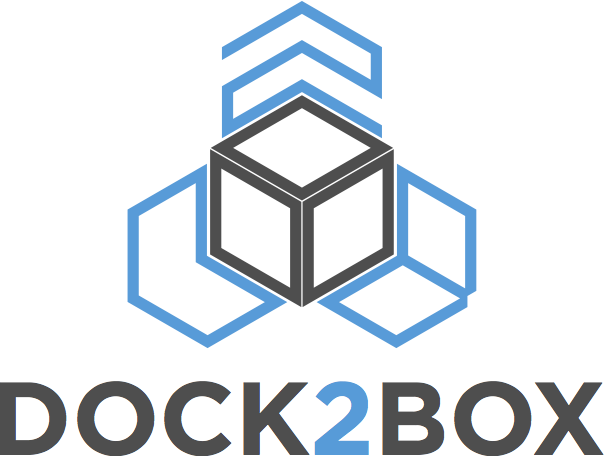

<p align="center">
  
</p>

# What?

Dock2Box is a tool that allows you to apply Docker or File images to bare-metal hardware using PXE boot.

# Why?

## Late vs early binding

Traditional host provisioning uses tools such as Cobbler, Kickstart and Configuration Management tools such as SaltStack, Ansible, Puppet or Chef to
finalize the host configuration. This means most of the complexity is late-binding i.e. while the host is being provisioned.

By moving the complexity to the build step on a CI server, you move most of the complexity where it will fail earlier rather then later.

Obviously not everything can be early-binding, but you can keep the things that are late-binding to a minimum and thus uncover errors sooner.

## Faster

At our current setup we can provision a fully configured server in less than 3 min. The main limitation is bandwidth and the size of the host image.

## Idempotent (repeatable, predictable)

Since we're dealing with a host image it's much more repeatable and predictable.

## Testable

One of the main issues with Configuration Management is testability: it's very hard to test since each deployment is slightly different.

With images they are basically immutable i.e. easier to test.

## DevOps

DevOps is all about breaking the barriers in-between Dev and Ops. This starts by adopting the same toolchain.

In using Docker for host provisioning you can use the same toolchain for software deployment and host provisioning.

## Running software on Bare-Metal

There are situations when you want to run software on bare-metal, but keep the deployment process close to what you
already do with Docker. Now it's just a matter of changing your Base Image "FROM ..." in your Dockerfile and rebuild.

# Workflow


# Overview


# Structure

Directory | Description
--------- | -----------
base-images | Base images built using Packer and then imported into Docker
boot-images | Boot images used for PXE boot
build-images | Build image used during builds

# Default authentication

## Boot image

For the boot image you can **only** login as "root".

**Default user:** root

**Default password:** D0ck2B0x

## Base images

For the base images "root" is locked by default. You can use the following default credentials:

**Default user:** dock2box

**Default password:** D0ck2B0x

# Kernel options

Option | Type | Description
------ | ---- | -----------
quiet | generic | Boot kernel in quiet mode and use progress bar
video | generic | Set uvesafb video mode ex. 800x600-32
dma | generic | Disable DMA since it can cause issues
modules=module:module | generic | Load kernel modules
blacklist=module:module | generic | Blacklist kernel modules
install | generic | Install OS, this will wipe disks so do a backup first
sshkey=AAAAB3NzaC1y... | security | Add SSH key to "authorized_keys" for "dock2box" user
distro=distribution | image | Distribution being provisioned centos, fedora or ubuntu
image=repo/image | image | Host image name
tag=tag | image | Host image tag, defaults to "latest"
registry=registry:port | image | Docker registry, defaults to Docker Hub
hostname=hostname | network | Short hostname
ip=ip:netmask:gw | network | Static IP, defaults to DHCP
interface=name | network | Network interface, defaults to first interface
dns=dns1:dns2:search | network | DNS configuration
gpt | disk | Use GPT partitions
root_size=size | disk | size of "/root", ex. "10G"
var_size=size | disk | Size of "/var", ex. "15G"
swap_size=size | disk | Size of "swap", ex. "4G"

# Example iPXE script

```
#!ipxe

kernel http://my-server/dock2box/boot-images/alpine3.4.3/kernel distro=centos image=dock2box/centos7.2.1511 install gpt quiet video=800x600-32 splash
initrd http://my-server/dock2box/boot-images/alpine3.4.3/initrd
boot
```
